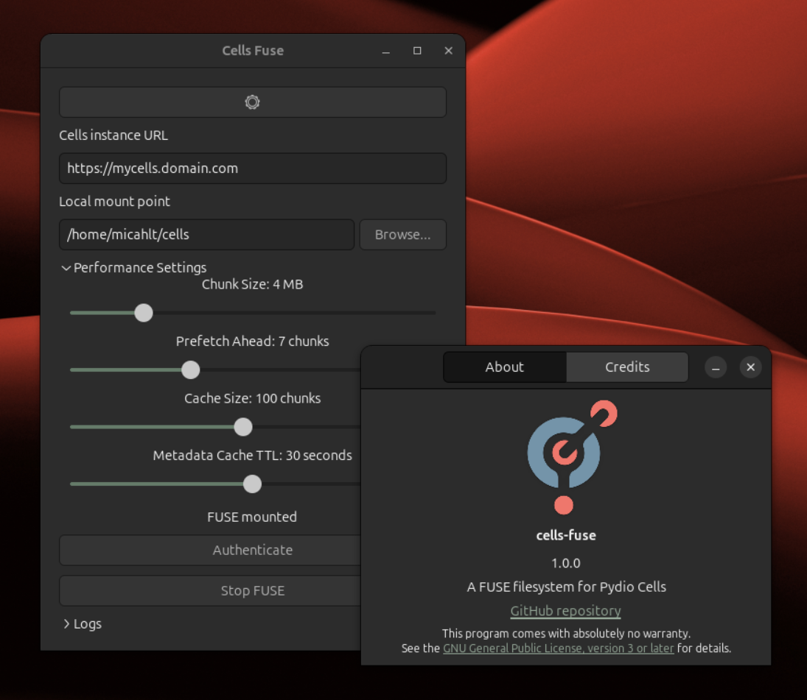

# Pydio Cells FUSE Client

A FUSE filesystem for Pydio Cells, written in Go + GTK4

>[!CAUTION]
> This project is in the alpha stage.  It hasn't been thoroughly tested, and while it _probably_ won't delete all your files, don't use it on a server that you don't have a backup of.  It's also worth noting that this is my first project in Go, and a lot of the code is cobbled together from stuff I found on the internet.

### Supported Platforms

Theoretically, this project is supported on Linux, Windows, and macOS.  At this stage, it has only been compiled and tested on Linux.

### Usage

Download the latest binary from the [releases page](https://github.com/micahlt/cells-fuse/releases/latest) and run it.  If it won't open, make sure that you've set it as executable (`sudo chmod +x cells-fuse`).  Enter your server URL, click the

### Development

Both the frontend and backend are written in Go, thanks to [cgofuse](https://github.com/winfsp/cgofuse) and [gotk4](https://github.com/diamondburned/gotk4).  Development should be as simple as installing those packages' dependencies and then running `go run .`.  The first run may take a while while the GTK4 dependencies compile.